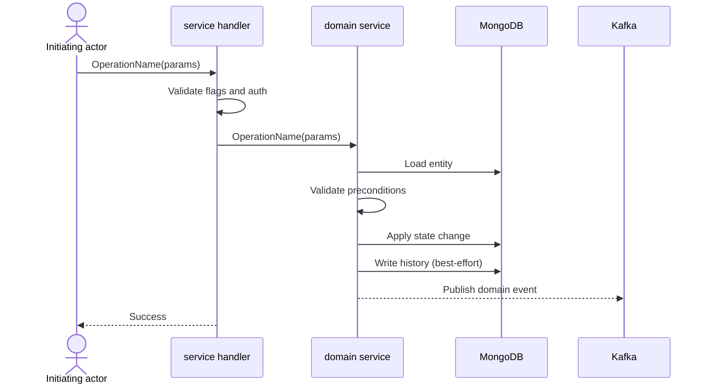
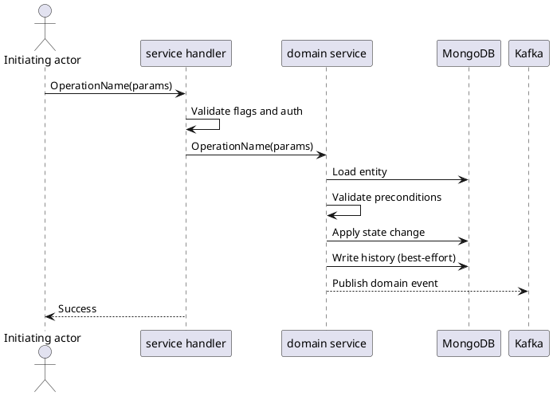

# Creating Flow Docs

## Overview

A flow doc is a single-page behavioural contract for one user-or-system-triggered operation. It answers — without referencing source code paths — *who initiates, what services touch it, what must be true before, what state/events change after, what is the success/failure path, what edge cases exist*. One operation per file. Fixed heading order. No H3.

## When to use / not to use

**Use for:** documenting an operation's observable behaviour — mutations, queries, cron jobs, legacy/partial APIs.

**Do not use for:**
- API reference docs (enumerate all fields/types exhaustively)
- Architecture/design docs (system-wide structure, not individual operations)
- Runbooks (operational, not behavioural)
- In-code documentation

## Pick a variant first

| Variant | Use when | Key differences |
|---|---|---|
| **A. Write/action** | Operation mutates entity state | Preconditions; "What changes" lists mutations; optional state-diagram; errors list |
| **B. Read/query** | Operation only reads + returns payload | "What changes" describes return shape; no state diagram; sequence uses `alt`/`else` for entity-type branches |
| **C. System/cron** | Triggered by cron, hook, or internal event — no human initiator | Replace "Preconditions" → "When triggered"; actor is `Trigger`/`Cron` |
| **D. Gap-doc / legacy** | Documenting a mismatch between documented/expected behaviour and what's actually implemented | Different section set entirely: Current Behavior → Impact → Current Flow (single mermaid flowchart) → Recommended Fix (ending in a Verification checklist) |

## Workflow

1. **Pick variant** — A, B, C, or D.
2. **Mirror project conventions** — read the project's own conventions doc if one exists (e.g. `docs/{domain}/flows/conventions.md`), then 1–2 existing flows in the target directory. Mirror their language (Russian, English, etc.), actor names, service-naming style, **and diagram convention** — whether diagrams are paired mermaid+plantuml or mermaid-only. Do not impose a different language, and do not add or drop the plantuml twin against local practice.
3. **Pick ordinal NN** — next two-digit number after the highest existing file in the directory.
4. **Draft the file** — use section order below. Filename: `NN-kebab-case.md`. (Variant D uses its own section set — see below.)
5. **Diagram(s) per local convention** — if the project pairs diagrams (per step 2), write mermaid first then an identical-content plantuml twin immediately after. If the project is mermaid-only, write mermaid only.
6. **Update cross-refs** — add a link in the sibling `index.md` (in ordinal order); update companion architecture/overview docs (e.g. `architecture.md`, `<domain>-flow.md`) if the flow adds a new operation type or changes a documented invariant.

## Section-by-section reference

Translate all heading text to the project's working language. Variants A, B, and C share the section list below with small per-variant tweaks (noted inline). **Variant D uses a different section set entirely** — see "Variant D section set" below instead of applying this shared list.

### `# NN. Title`

The operation name in prose. Matches the filename minus the ordinal.
Example: `# 03. Approve заказа`.

### What happens (Что происходит)

1–2 sentences: initiating actor + core state change. No lists.

> `"Approve order в \`pending\` переводит его в \`approved\`, если order не blocked по \`holdType\`."`

### Who participates (Кто участвует)

Bullets: human actor(s) first, then services in call order, then storage, then message bus.

```
- Оператор.
- Internal handler в `orders-api`.
- Order service в `orders`.
- MongoDB.
- Kafka order events.
```

### Preconditions (Перед стартом) — variants A / B

Bullets in order: feature flag → auth → required headers → entity existence → entity state.

```
- `enableOrderApproval` включен.
- Есть service auth.
- Передан header `admin-id`.
- Order существует.
- Order в `orderStatus=pending`.
```

### When triggered (Когда запускается) — variant C only

Bullets listing events or schedule that fire the operation.

### Variant D section set (replaces the shared list above)

Gap-docs document a mismatch between documented/expected behaviour and what's actually implemented — not a normal operation. They drop Who participates, Preconditions, What changes, Sequence, Branching, State, Errors, and Caveats entirely, in favour of this fixed order:

1. `# NN. Title` — same as other variants.
2. **Current Behavior** — prose (no bullets) describing what's documented/expected vs. what the system actually does.
3. **Impact** — bullets: concrete, caller-visible consequences of the gap (client confusion, contract drift, agent/LLM-unfriendliness).
4. **Current Flow** — one mermaid `flowchart TD` showing the present (gap-including) path. Pair with plantuml only if local convention pairs diagrams elsewhere (see Diagram pairing rule).
5. **Recommended Fix** — prose stating the preferred remediation, then bullets for the implementation shape, ending with a `Verification:` bullet list of concrete, testable assertions that prove the fix — not a task checklist.

### What changes (Что меняется)

Variants A/C: one mutation per bullet — field assignments, best-effort side-writes, conditional Kafka emissions, negative side effects.

```
- `orderStatus=approved`.
- `holdType=none`.
- `isBlocked=false`.
- History action `approve` пишется без отката основной операции.
- Order state event публикуется в Kafka, если order имеет валидный `customerId`.
```

Variant B: describes the return shape (pagination, enrichment, optional best-effort loads).

```
- Возвращается список элементов очереди и `totalCount`.
- Для order queue имена customer подтягиваются отдельно, без падения основного ответа.
```

### Sequence (Последовательность)

mermaid `sequenceDiagram` followed immediately by a plantuml `@startuml` twin — identical semantics. Use `actor X as <local name>` for human actors, `participant Y as <service name>` for services.

Variant B: use `alt` / `else` / `end` blocks for entity-type branches.
Variant C: use `participant` (not `actor`) for the trigger.

### Branching (Развилка) — when there are non-trivial decision points

mermaid `flowchart TD` + plantuml `rectangle` twin. Decision nodes use `{curly braces}`. Edges labelled `yes`/`no` or with the branching value. Terminal nodes name the error code or success outcome.

Only include when a meaningful branch is not already obvious from the sequence diagram.

### State (Состояние) — variant A only, when a status field flips

mermaid `stateDiagram-v2` + plantuml twin. Label transitions with the RPC name; label failure states with the resulting gRPC code.

### Errors (Ошибки) — variant A only

Bullets: `` `GrpcCode`: <condition> ``. List every non-success code the caller can receive.

```
- `Unimplemented`: order approval flag выключен.
- `PermissionDenied`: нет service auth.
- `InvalidArgument`: нет uuid или `admin-id`.
- `NotFound`: order не найден.
- `FailedPrecondition`: order не `pending`, blocked по `holdType`.
```

### Caveats / Edge cases (На что смотреть / Краевые случаи)

2–4 bullets: things the flow does NOT do, race windows, downstream-only effects, interactions with other flows.

> `"Force unblock order ставит \`skipAutoHold=true\`, чтобы этот флоу не заблокировал order сразу обратно."`

## Conventions

### Language mirroring

Read 1–2 existing flows in the target directory before writing. Mirror their language, actor names, and service-naming style. If no existing flows, default to English. Never mix languages in prose. Identifiers (RPC names, fields, flags, error codes, service names) are always backtick-wrapped regardless of prose language.

### Diagram pairing rule

Many projects pair every Sequence / Branching / State diagram with **both** a mermaid block and an identical-content plantuml twin — mermaid first, plantuml second. This makes flow docs renderable in both mermaid-aware and plantuml-aware tools without losing information.

This is not universal — mirror local convention instead of assuming it. Some projects standardize on mermaid only and say so in their own conventions doc, or simply never carry a plantuml block in any existing flow. Follow workflow step 2: check the project's conventions doc if one exists, otherwise read 1–2 existing flow docs, and match what you find. Do not add a plantuml twin to a mermaid-only project; do not drop the twin from a project that pairs them.

### Service-naming pattern

Name each service two ways where relevant: deployment name and logical name. Example: `Internal handler в \`orders-api\`` + `Order service в \`orders\``. Both backticked.

### No source-code citations

Flow docs are code-agnostic by design — they survive refactors because they describe observable behaviour, not implementation. Never add `path/to/file.go:123`, `pkg/handler.go`, or any other file path. Reference RPCs, fields, flags, and services only.

## Diagram pairing template

Use this pairing only when the project's own convention pairs diagrams (see Diagram pairing rule). If the project is mermaid-only, drop the plantuml block and keep the mermaid one.

Copy and adapt for a write/action flow:





Dashed arrows (`-->>` / `-->`) denote async or best-effort calls.

## Quality checklist

Applies to variants A/B/C. For variant D, check instead: Current Behavior is prose with no bullets, Impact and Recommended Fix are bullets, Current Flow is a single mermaid flowchart, and Recommended Fix ends with a `Verification:` bullet list.

- [ ] Feature flag named explicitly as first precondition bullet
- [ ] Auth requirements listed (service-auth, header IDs) when applicable
- [ ] Each state mutation is a separate bullet in "What changes" (no combined mutations)
- [ ] Best-effort side-writes called out: `"... writes without rolling back the main operation"`
- [ ] Conditional event emissions stated: `"... publishes only if <condition>"`
- [ ] Negative side effects named: `"... does not publish"`, `"... does not change X"`
- [ ] gRPC codes appear in branching-diagram terminals AND in the Errors list
- [ ] No `.go:NN` or file-path citations anywhere in the document
- [ ] plantuml twin written for every mermaid diagram when the project pairs diagrams (count: mermaid == plantuml) — skip only if the project's own convention is mermaid-only
- [ ] Caveats section includes at least one "does NOT do X" statement
- [ ] File linked from `index.md` in ordinal order
- [ ] Companion architecture/overview docs updated if a new operation type is introduced

## Common mistakes

| Mistake | Fix |
|---|---|
| Adding a plantuml twin to a mermaid-only project, or dropping it from a project that pairs them | Check convention (workflow step 2) before drawing diagrams; mirror what's there |
| Writing prose in a different language than existing docs | Read 1–2 existing flows first; mirror their language |
| Adding `.go:NN` or file paths | Flow docs are code-agnostic; remove all source paths |
| Feature flag absent from preconditions | Add as the first bullet; it is always the first gate |
| Combining mutations into one bullet | One mutation per bullet in "What changes" |
| Omitting negative side effects | Explicitly state what the flow does NOT do |
| Using H3 headings | Flow docs have no H3; flatten any sub-sections into bullets |
| Forgetting to update `index.md` | Do it as step 6 of the workflow before closing the task |
| Giving variant D the shared A/B/C section list | Gap-docs use their own set: Current Behavior → Impact → Current Flow → Recommended Fix |

## Reference exemplars

Before drafting, read an existing flow doc in the project as the source of truth. Look first
in the project's own `docs/<domain>/flows/` directory; if none exists yet, the four canonical
variants below define the shape:

- **Variant A — Write/action:** a state-changing operation (approve, submit, create).
- **Variant B — Read/query:** a read path (list, get, search) with its filters and shape.
- **Variant C — System/cron:** a scheduled or event-driven job (sweeper, auto-block).
- **Variant D — Gap-doc:** documenting a mismatch between documented/expected behaviour and what's actually implemented — Current Behavior → Impact → Current Flow → Recommended Fix, not the shared A/B/C list.

The first flow doc you write for a project becomes that project's exemplar — invest in it.
